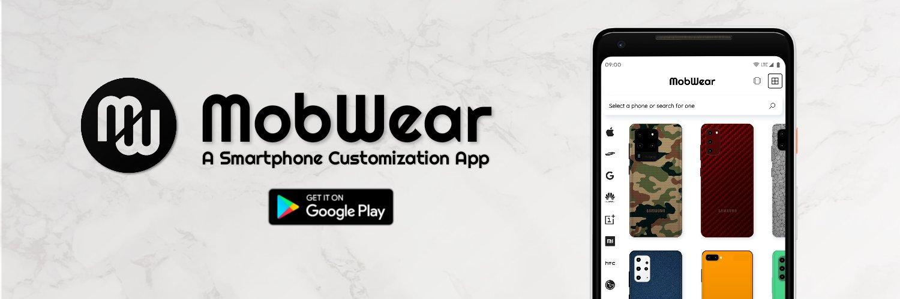
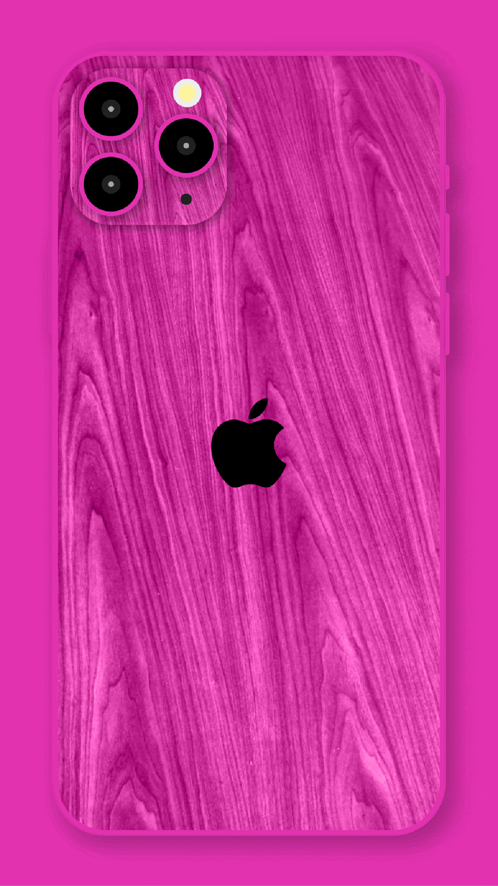
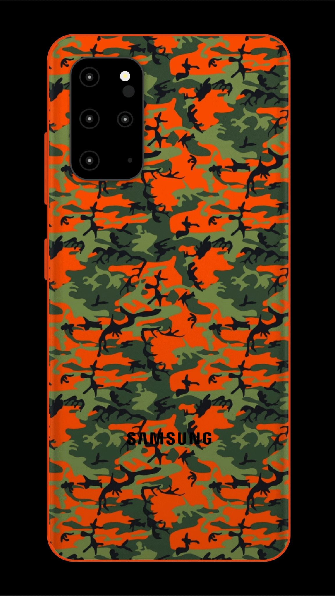
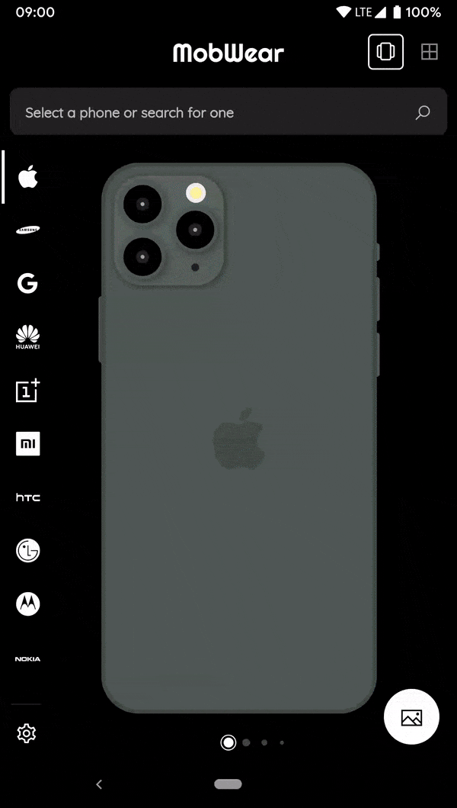
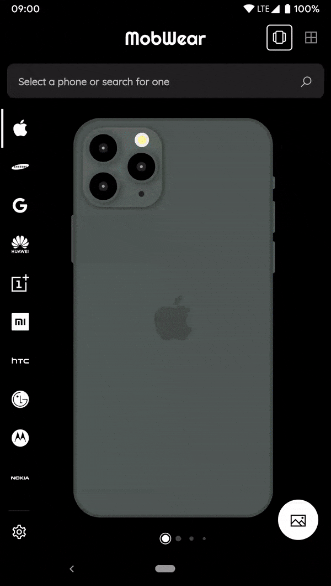
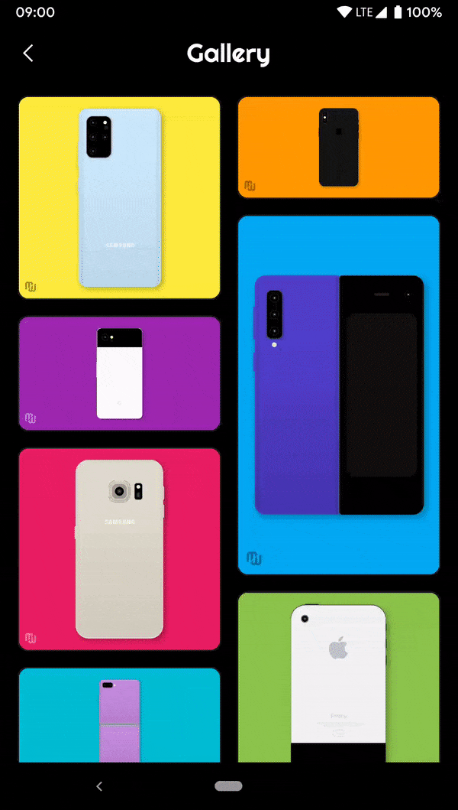
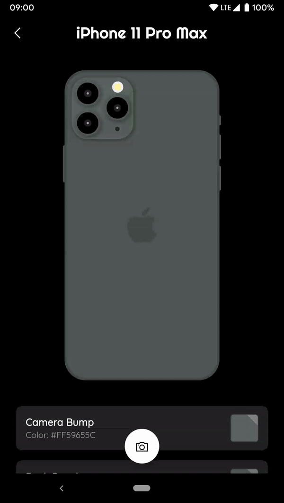

# MobWear
A Smartphone Customization App

### About

MobWear is a cross-platform application that allows its users to express their creativity and style by applying various combinations of colors and textures to their favorite smartphones.
The app currently has a catalogue of thirty-two phones from three of the world’s major smartphone makers with more on the way. MobWear allows its users to capture their customized phones on selected color, textured or image backgrounds and share their customizations with the world. There’s also a bonus feature to view the specs of the smartphones.

### Smartphone Catalogue

MobWear has a (currently incomplete) catalogue of smartphones from ten of the world’s major smartphone manufacturers. Each phone is built from scratch allowing maximum integration with the customization framework of the app. Having the phones built within the app also allows the phones to be animated to give them life.

### Download
MobWear is available on the Play Store. Click [here](https://play.google.com/store/apps/details?id=com.arthurdev.mobwear) to download and try it out.
Please leave a review, but only if you liked it :D

### Showcase

| Colors & Textures | | Texture Blend Modes |
| :---: | --- | :---: |
|  ||  |
| Customize phones with a combination   of colors and textures || Applying Texture Blend Modes transforms   textures and gives a whole new look |

| Homepage | | Search Animation |
| :---: | --- | :---: |
|  ||   |
| Homepage can be in Carousel View   or Grid View per user preference || Intuitive animations when a phone is   selected from search results |

| Gallery Page || View Image |
| :---: | --- | :---: |
|  ||  |
| View captured phones in a   gallery with a staggered grid view || View images in your gallery   and perform actions on them |

| Flip for Specs || View Specs |
| :---: | --- | :---: |
|  ||  |
| Flip any smartphone to   view its specs || Specs are viewed on the phone's   screen giving an app-within-app effect |
